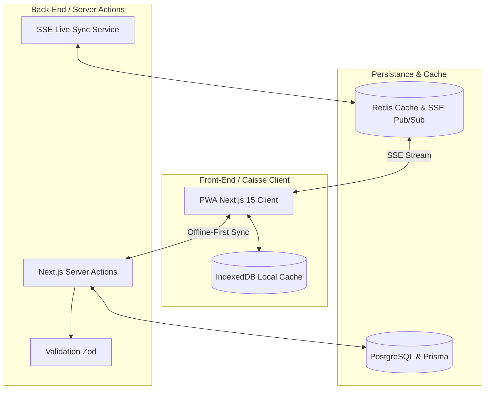
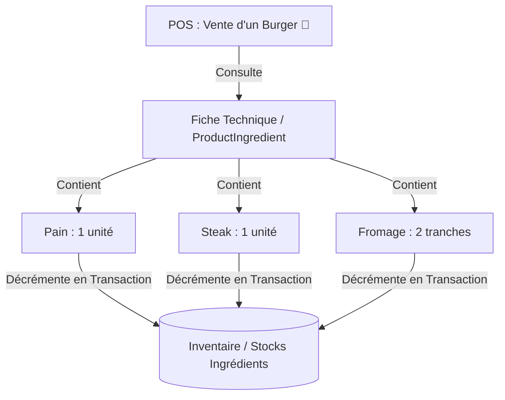

# Gourmet POS 🍽️ — Manuel Technique Complet & Guide d'Architecture

Bienvenue dans la documentation officielle de **Gourmet POS**, la plateforme de caisse enregistreuse (POS) et de commande en ligne multi-tenant de niveau entreprise, spécialement conçue pour le secteur de la restauration de haute performance.

---

## 🏗️ 1. Architecture Générale de la Plateforme

Le système est architecturé de manière modulaire à 3 couches découplées pour garantir une robustesse, une scalabilité et une tolérance aux pannes maximales.



### 📱 Front-End / Mode Hors-Ligne (PWA)
*   **Next.js 15+ (App Router)** avec support natif pour les applications web progressives (PWA) via `@ducanh2912/next-pwa`.
*   **Mode Offline-First** : En cas de perte réseau, l'interface de caisse enregistreuse continue d'encaisser les commandes sans interruption grâce à un cache local dynamique orchestré sur **IndexedDB** (`src/lib/idb.ts`). Les commandes en attente sont synchronisées automatiquement vers le serveur principal dès la reconnexion.

### ⚙️ Back-End & Services Applicatifs
*   **Next.js Server Actions** sécurisées pour la gestion transactionnelle métier côté serveur, avec une validation stricte des entrées utilisateurs via des schémas **Zod**.
*   **Sécurité** : Authentification et sessions multi-tenant contrôlées de manière étanche par **NextAuth.js**.

### 🗄️ Données & Cache Temps Réel
*   **Base de Données Principale** : PostgreSQL hébergé, modélisé et accédé de façon optimisée via **Prisma ORM**.
*   **Synchronisation Cuisine (KDS)** : Connexion en temps réel par **Server-Sent Events (SSE)** synchronisée via un bus de messages **Redis (Pub/Sub)**, permettant aux cuisiniers d'afficher instantanément les commandes dès l'encaissement.

---

## 👥 2. Rôles et Droits Utilisateurs

Le système gère 5 types de rôles avec une isolation stricte des données par établissement (Store) :

| Rôle | Périmètre d'Action | Interfaces Accessibles |
| :--- | :--- | :--- |
| **SUPER_ADMIN** | Supervision globale, gestion des boutiques, facturation et finances globales. | `/admin` (Commissions, Stores, Supervision globale) |
| **ADMIN** | Administrateur délégué de la plateforme. | `/admin` |
| **RESTAURATEUR** | Gérant d'une enseigne spécifique. Contrôle complet des effectifs, contrats, paie, stocks, fiches techniques et suppléments. | `/restaurateur` (Stocks, RH, Livraisons, Supports) |
| **CASHIER** | Utilisation de l'interface POS pour les ventes. | `/caisse` / `/pos` (POS tactile optimisé) |
| **KITCHEN** | Utilisation de l'interface KDS pour la préparation. | `/kds` (Kitchen Display System tactile) |

---

## 💼 3. Module Ressources Humaines (RH) & Fiscalité Ivoirienne

Le module RH permet une automatisation totale de la paie, de la gestion des effectifs et du suivi de carrière selon les spécificités de la législation fiscale de la **Côte d'Ivoire**.

### 🧬 Structure de la Base de Données (Prisma)
Le schéma intègre désormais les entités clés suivantes :
*   `Contract` : Gestion des types de contrats (**CDI, CDD, Stage**) avec suivi des salaires de base et statuts (ACTIVE, TERMINATED, EXPIRED).
*   `ContractTermination` : Archive les ruptures de contrats, motifs et indemnités associées.
*   `UserHistory` : Consigne l'historique de carrière (Promotions, transferts, variations de salaire brut).
*   `Payroll` : Enregistre les fiches de paie générées par mois (`YYYY-MM`), avec salaire net calculé, cotisations salariales (CNPS) et patronales, impôts (ITS, CN, IGR), statut de paiement (PENDING, PAID) et date de versement.
*   `LeaveRequest` : Suivi des absences et congés (**Payé, Maladie, Maternité, Sans solde**) avec décompte automatique des jours et validation par le restaurateur.
*   `Loan` : Gestion des avances sur salaire et prêts à tempérament avec calcul de retenue mensuelle fixe.
*   `Evaluation` : Revues annuelles ou périodiques de performance (notes, compétences JSON, objectifs JSON).
*   `HrConfiguration` : Configuration centralisée par store pour ajuster les taux de charges sans modifier le code source.

---

### 🧮 Moteur de Calcul Fiscal Ivoirien (`ivoryCoastTax.ts`)

Le calculateur fiscal évalue automatiquement les cotisations à partir du salaire de base brut, en appliquant les règles législatives de la DGI (Direction Générale des Impôts) et de la CNPS de Côte d'Ivoire.

> [!NOTE]
> Les calculs fiscaux utilisent les règles exactes de l'administration ivoirienne (barèmes mensuels CN & IGR).

#### 1. Cotisation CNPS Salariale
Appliquée par défaut à **6,3%** du salaire de base brut, plafonnée à un plafond légal de **1 647 315 FCFA** par mois :
$$\text{CNPS Salariale} = \min(\text{Salaire Brut}, \text{Plafond CNPS}) \times 6.3\%$$

#### 2. Impôt sur les Traitements et Salaires (ITS)
Appliqué sur la **base imposable** (égale à 80% du salaire brut global) au taux de **1,2%** :
$$\text{Base Imposable} = \text{Salaire Brut} \times 80\%$$
$$\text{ITS} = \text{Base Imposable} \times 1.2\%$$

#### 3. Contribution Nationale (CN)
Calculée par tranches progressives basées sur la base imposable brute :

| Tranche de Base Imposable (mensuel) | Taux Appliqué |
| :--- | :--- |
| De **0** à **50 000 FCFA** | **0%** |
| De **50 000** à **130 000 FCFA** | **1,5%** |
| De **130 000** à **200 000 FCFA** | **5%** |
| Supérieur à **200 000 FCFA** | **10%** |

#### 4. Parts Fiscales (Quotient Familial)
Le nombre de parts fiscales utilisé pour l'IGR dépend de la situation matrimoniale et du nombre d'enfants à charge (plafonné à **5 parts**) :
*   **Célibataire / Divorcé(e)** : 1 part de base (+ 0,5 part par enfant à charge).
*   **Marié(e) / Veuf(ve)** : 2 parts de base (+ 0,5 part par enfant à charge).

#### 5. Impôt Général sur le Revenu (IGR)
L'IGR se calcule à partir de la base IGR nette ajustée du Quotient Familial ($Q$) :
$$\text{Base IGR} = (\text{Base Imposable} - \text{ITS} - \text{CN}) \times 85\%$$
$$Q = \frac{\text{Base IGR}}{\text{Nombre de Parts}}$$

Le quotient $Q$ est ensuite confronté au barème mensuel progressif de l'IGR ivoirien pour obtenir l'impôt brut par part ($I$), minoré de sa déduction associée :
$$\text{IGR Total} = I \times \text{Nombre de Parts}$$

---

### 🖨️ Gestion de la Paie & Impression des Bulletins
*   **Génération en 1 Clic** : À chaque fin de période (ex: `2026-05`), le système recherche les contrats actifs et génère automatiquement les lignes de paie (`Payroll`) en intégrant le calcul fiscal, les absences validées et les déductions d'emprunts.
*   **Bulletins de Paie Professionnels** : Le restaurateur peut imprimer des bulletins de paie complets via un gabarit d'impression haute-fidélité (`PayrollPayslipTemplate.tsx`) respectant la charte graphique officielle du pays.

---

## 🍏 4. Module Gestion des Stocks & Fiches Techniques

Le module des stocks a évolué d'un simple suivi de quantité de produits finis vers un véritable **système d'inventaire par ingrédients et fiches techniques**.



### 📦 Fiches Techniques (Recipes)
*   Chaque produit peut être rattaché à une fiche technique listant les matières premières (ingrédients) nécessaires à sa préparation.
*   Exemple : Un "Double Cheese" nécessite du pain burger (1), du fromage (2 tranches), du steak haché (2) et de la sauce (15ml).

### ⚡ Décompte Automatique en Temps Réel
*   Lorsqu'une commande est validée sur la caisse, la transaction de base de données exécute la fonction `decrementIngredientInventory()` dans `actions/inventory.ts`.
*   Le système calcule et déduit automatiquement la quantité exacte d'ingrédients bruts de l'inventaire en fonction de la quantité commandée.
*   **En cas d'annulation** : Les stocks d'ingrédients bruts sont immédiatement recrédités via la fonction `incrementIngredientInventory()`.
*   **Seuils d'Alerte** : Un indicateur visuel signale instantanément au restaurateur les ingrédients passés sous leur niveau de stock minimal configuré.

---

## ➕ 5. Suppléments & Retraits d'Ingrédients (Customisation POS)

Le système intègre un moteur de gestion de suppléments et de personnalisation dynamique pour s'adapter à la demande des clients :

*   **Suppléments d'Ingrédients** : Ajout d'options (ex: "Double Fromage + 150F", "Extra Bacon + 300F") augmentant automatiquement le prix final de l'article dans le panier.
*   **Retrait d'Ingrédients** : Possibilité de spécifier des demandes spéciales de retrait (ex: "Sans Oignon", "Sans Tomate") enregistrées et imprimées de façon claire sur le ticket de caisse et sur l'écran cuisine (KDS).
*   **Zustand Sync** : La structure des commandes au niveau de l'état applicatif local (`useCart.ts`) prend en charge nativement ces options personnalisées pour calculer le prix brut global instantanément à chaque manipulation du panier.

---

## 🖲️ 6. Maintenance & Scripts Automatisés

### Sauvegardes de Base de Données (`backup.sh`)
Un script shell robuste sauvegarde quotidiennement la base de données PostgreSQL en local à l'aide de `pg_dump`, avec une compression `gzip` et une politique stricte de rétention sur 7 jours.

#### Planification Cron (Recommandée)
Pour exécuter la sauvegarde toutes les nuits à minuit :
```cron
0 0 * * * /home/hp/Documents/Iaprojet/restaurant/scripts/backup.sh >> /var/log/pos_backup.log 2>&1
```

---

## ☸️ 7. Déploiement Kubernetes & CI/CD sur VPS

Le projet Gourmet POS est prêt pour une infrastructure cloud native grâce aux manifestes de déploiement Kubernetes configurés dans le dossier `/k8s`.

### 📂 Architecture des Manifestes K8s
1.  `namespace.yaml` : Isole toutes les ressources du projet au sein du namespace isolé `pos-app`.
2.  `secret.yaml` : Stocke de manière sécurisée les variables d'environnement critiques (`DATABASE_URL`, `REDIS_URL`, `NEXTAUTH_SECRET`).
3.  `postgres-statefulset.yaml` : Assure la persistance des données de PostgreSQL à l'aide d'un PersistentVolumeClaim (PVC).
4.  `redis-deployment.yaml` : Déploie l'instance de cache et SSE en interne dans le cluster.
5.  `app-deployment.yaml` & `app-service.yaml` : Orchestre le déploiement multi-réplicas de l'application Next.js 15 sous forme de pods hautement disponibles et équilibre la charge via un service K8s.

### 🚀 Processus de Mise à Jour (`update-db.sh`)
Le script `update-db.sh` à la racine a été mis à niveau pour cibler l'architecture Kubernetes de manière native. Il permet de :
1.  Construire l'image Docker optimisée pour la production.
2.  Pousser l'image privée.
3.  Appliquer les manifestes mis à jour dans le cluster Kubernetes.
4.  Déclencher un déploiement progressif sans interruption (Rolling Update) et surveiller la stabilité du rollout.

Pour lancer un déploiement complet :
```bash
K8S_IMAGE_NAME=votre-registre/pos-app:latest K8S_PUSH_IMAGE=true ./update-db.sh
```

---

*Documentation technique mise à jour avec excellence pour garantir une fiabilité opérationnelle à 100% en production.*
