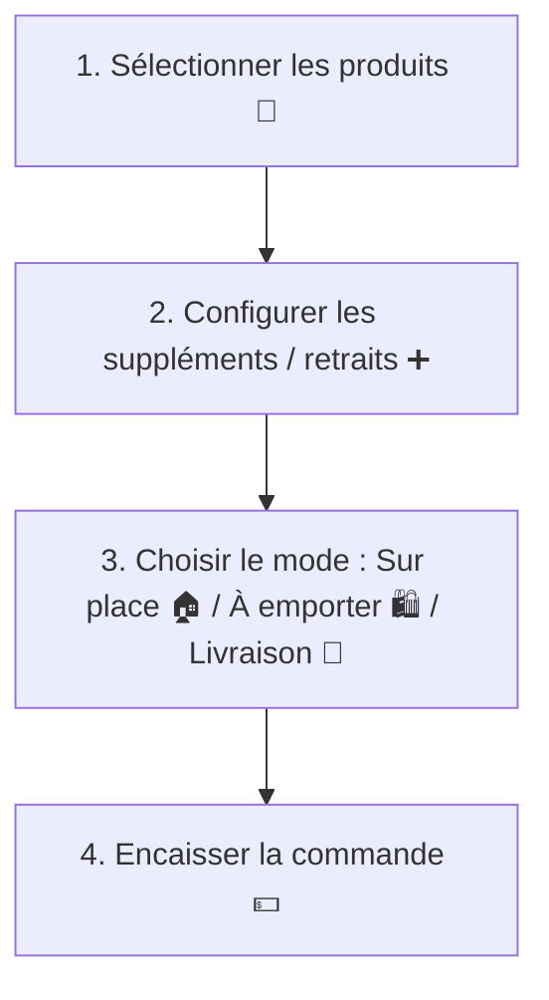
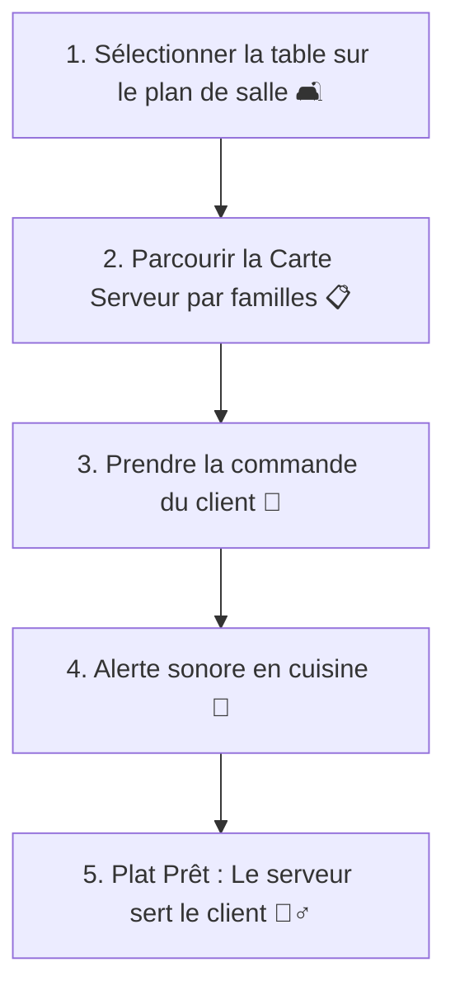
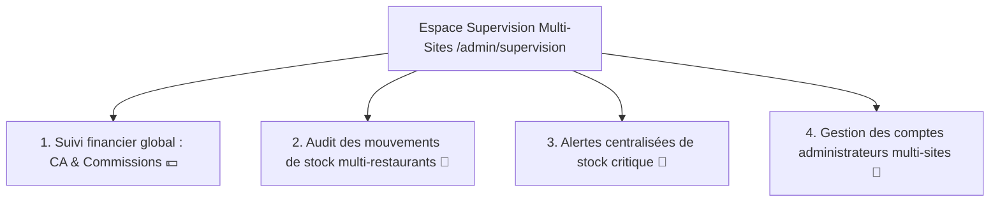

# Gourmet POS 🍽️ — Guide de Formation & Supports Utilisateurs

Bienvenue dans le guide de formation de la plateforme **Gourmet POS**. Ce document est conçu comme un support d'apprentissage interactif pour accompagner les différents acteurs de votre restaurant dans la prise en main quotidienne du système.

---

## 🎯 Sommaire des Parcours de Formation
Sélectionnez votre profil pour accéder à votre guide étape par étape :

1. [🟢 Le Caissier / Caisse Tactile (POS)](#1-le-caissier--caisse-tactile-pos)
2. [📱 Le Serveur / Service en Salle (Tablette)](#2-le-serveur--service-en-salle-tablette)
3. [👨‍🍳 Le Cuisinier / Écran Cuisine (KDS)](#3-le-cuisinier--écran-cuisine-kds)
4. [👔 Le Restaurateur / Manager d'Établissement](#4-le-restaurateur--manager-détablissement)
5. [⭐ Le Superviseur / Espace Supervision Multi-Sites](#5-le-superviseur--espace-supervision-multi-sites)

---

## 1. 🟢 Le Caissier — Caisse Tactile (POS)

L'interface de caisse est optimisée pour être ultra-rapide, tactile et 100% opérationnelle, même sans connexion internet.



### 📱 Étape 1 : Saisir une commande classique
1. Connectez-vous avec vos identifiants caissier.
2. Sur l'écran principal, cliquez sur les catégories à gauche (ex: *Burgers, Boissons*) pour filtrer.
3. Cliquez sur un produit pour l'ajouter au panier à droite.

### ➕ Étape 2 : Ajouter des suppléments ou demander des retraits
1. Dans le panier, cliquez sur le nom d'un produit ajouté.
2. Une fenêtre d'options s'ouvre :
   * **Suppléments** : Cochez les ingrédients supplémentaires demandés par le client (ex: *Extra Bacon + 300F*). Le prix total s'ajuste instantanément.
   * **Retraits** : Décochez ou indiquez les ingrédients à retirer (ex: *Sans Oignon*).
3. Cliquez sur **Valider**. La mention apparaîtra sous le produit dans le panier et sera transmise en cuisine.

### 🛋️ Étape 3 : Assigner une table (Mode "Sur place")
1. En bas du panier, cliquez sur **Choisir une table**.
2. Le plan de salle interactif s'affiche :
   * **Vert** : Table disponible.
   * **Orange** : Table occupée.
3. Cliquez sur le numéro de table souhaité pour y rattacher la commande.

### 💳 Étape 4 : Encaisser et Choisir le mode de paiement
1. Cliquez sur le bouton orange **Encaisser** (ou *Valider la commande*).
2. Sélectionnez le mode de règlement : **Espèces**, **Mobile Money** (Orange, Wave, MTN), ou **Carte Bancaire**.
3. Saisissez le montant reçu si le client paie en espèces : la caisse calcule automatiquement le rendu de monnaie.
4. Cliquez sur **Imprimer le ticket** pour sortir la note physique.

> [!IMPORTANT]
> **🚀 Mode Hors-Ligne (Offline-First)**  
> Si votre connexion internet se coupe, **ne fermez pas la caisse !**  
> Une alerte **"Mode Hors-Ligne Actif"** s'affiche en haut de votre écran. Vous pouvez continuer d'encaisser les clients normalement. Les ventes sont enregistrées localement et se synchroniseront automatiquement avec le serveur dès le retour d'internet.

---

## 2. 📱 Le Serveur — Service en Salle (Tablette)

L'Espace Serveur est une interface mobile-first, optimisée pour le service à table en salle depuis une tablette ou un smartphone.



### 🛋️ Étape 1 : Démarrer le service d'une table
1. Connectez-vous avec vos identifiants Serveur. Vous êtes automatiquement redirigé vers l'interface **/serveur**.
2. **Choix obligatoire de la table** : Le système vous force à sélectionner d'abord la table sur le plan de salle interactif avant d'ajouter le moindre produit. Cela évite les erreurs d'attribution de commande.
3. Une fois la table validée, accédez à la **Carte Serveur**.

### 📋 Étape 2 : Prendre la commande via la "Carte Serveur"
1. La Carte Serveur s'affiche sous forme de fiche de menu épurée. Parcourez les familles de produits (Entrées, Plats, Desserts, Boissons).
2. Saisissez les demandes du client en ajoutant les articles au panier.
3. Configurez les suppléments et les retraits d'ingrédients à la volée.
4. Cliquez sur **Envoyer en cuisine**. La commande est instantanément envoyée au KDS cuisine.

### 🔔 Étape 3 : Gérer les alertes et appels clients
Les clients peuvent appeler un serveur en scannant le QR code sur leur table :
1. Lorsqu'un client clique sur **"Appeler un serveur"** depuis son interface client, une notification **"🔔 Appel serveur"** apparaît sur votre tablette en temps réel, indiquant le numéro exact de la table.
2. Une alerte vibrante ou sonore se déclenche. Allez voir la table concernée.
3. Une fois l'appel traité, masquez l'alerte depuis votre écran de tickets de service.

### 🏃‍♂️ Étape 4 : Servir les commandes prêtes
1. Dès que les cuisiniers terminent la préparation d'un plat, la carte passe dans la colonne **"En attente du serveur"** sur l'écran cuisine.
2. Une notification vous prévient que le plat de la *Table X* est prêt au comptoir.
3. Récupérez le plat, servez le client, puis marquez la commande comme **Servie** sur votre interface de table.

---

## 3. 👨‍🍳 Le Cuisinier — Écran Cuisine (KDS)

Le Kitchen Display System (KDS) remplace les tickets papier et synchronise la cuisine en temps réel avec la caisse.

### 🔔 Réception des commandes
* Dès qu'une commande est validée par la caisse ou le serveur, elle apparaît instantanément sur l'écran KDS sous forme de carte interactive.
* Une **alerte sonore native** se déclenche à chaque nouvelle commande pour attirer l'attention de l'équipe cuisine.

### 🔄 Cycle de préparation d'un plat
Chaque commande passe par 3 statuts, représentés par des boutons d'action rapide sur chaque carte :

```
[ EN ATTENTE ] (Gris/Rouge) ➔ Cliquer sur "Préparer" ➔ [ EN PRÉPARATION ] (Orange) ➔ Cliquer sur "Prêt" ➔ [ PRÊT ] (Vert)
```

1. **Étape 1 : Commencer la préparation**
   * À l'arrivée de la commande, lisez les détails (les suppléments sont surlignés en vert et les retraits d'ingrédients clignotent/sont barrés en rouge).
   * Cliquez sur le bouton **Préparer**. La commande passe en orange, et le caissier et le serveur voient en temps réel que le plat est en cours de cuisine.
2. **Étape 2 : Signaler que la commande est prête**
   * Une fois le plat dressé et prêt à être envoyé, cliquez sur **Prêt**. La commande passe au vert et bascule dans la colonne **"En attente du serveur"** pour que le serveur la livre rapidement à table.

---

## 4. 👔 Le Restaurateur — Manager d'Établissement

Le Restaurateur gère la logistique, les matières premières, le personnel de son restaurant et pilote la rentabilité de sa boutique.

---

### A. Gestion du Personnel & des Contrats

#### 👥 1. Enregistrer un nouvel employé
1. Rendez-vous dans **Espace Restaurateur** > **RH / Effectifs**.
2. Cliquez sur **Ajouter un employé**.
3. Renseignez la fiche d'identité complète :
   * **Informations de base** : Civilité, nom, e-mail de connexion, téléphone personnel.
   * **Rôle** : Choisissez **Serveur**, **Caissier**, ou **Cuisine** pour lui octroyer l'interface correspondante.
   * **Informations RH** : Numéro Matricule (ex: *EMP-2026-004*), Numéro CNPS national.
   * **Informations bancaires** : Nom de la banque et RIB complet pour automatiser les virements de salaire.
4. Cliquez sur **Enregistrer**.

#### 📄 2. Rédiger et imprimer un contrat de travail
1. Dans l'onglet **Contrats**, cliquez sur **Nouveau contrat**.
2. Sélectionnez l'employé concerné, puis définissez :
   * Le type de contrat : **CDI**, **CDD** (renseignez la date de fin), ou **Stage**.
   * Le poste (ex: *Serveur*, *Cuisinier*).
   * Le **Salaire de Base Brut** mensuel.
3. Cliquez sur **Créer**.
4. Le contrat est généré au format légal ivoirien. Cliquez sur **Imprimer** pour obtenir une version papier signable avec mention de l'IDU et de la CNPS.

---

### B. Gestion Mensuelle de la Paie (Normes Côte d'Ivoire)

Le système intègre un moteur fiscal pour automatiser le calcul des salaires nets ivoiriens.

#### 🧮 1. Lancer la génération de la paie
1. Allez dans **RH / Paie**.
2. Sélectionnez la période concernée (ex: `2026-05`).
3. Cliquez sur **Générer les bulletins de paie**. Le système calcule automatiquement pour chaque employé ayant un contrat actif :
   * La part salariale **CNPS (6.3%)**.
   * L'impôt **ITS (1.2%)** sur le brut imposable (80% du brut).
   * La **Contribution Nationale (CN)** selon le barème progressif par tranches.
   * L'**IGR (Impôt Général sur le Revenu)** en calculant précisément le quotient familial par parts fiscales de l'employé (Célibataire, marié, enfants à charge).
   * Les déductions automatiques en cas d'avance sur salaire ou de prêts en cours.
4. Le **Salaire Net à Payer** et le **Coût Total Employeur** s'affichent pour validation.

#### 🖨️ 2. Distribuer les bulletins de paie
1. Cliquez sur **Consulter** sur la ligne d'un employé dans le tableau de paie.
2. Le bulletin officiel s'affiche au format réglementaire.
3. Cliquez sur **Imprimer** ou enregistrez-le en PDF pour transmission à l'employé.
4. Une fois le virement bancaire effectué, cliquez sur **Marquer comme Payé** et renseignez le numéro de référence du transfert.

---

### C. Gestion des Congés & Prêts

#### 📅 1. Traiter une demande de congé
1. Allez dans **RH / Congés & Absences**.
2. Les demandes des employés s'affichent avec leur type (**Congé Payé, Maladie, Maternité, Sans solde**), les dates de début/fin et le nombre total de jours.
3. Cliquez sur **Approuver** ou **Rejeter** en écrivant un commentaire d'explication.

#### 💰 2. Octroyer une avance ou un prêt
1. Allez dans **RH / Avances & Prêts**.
2. Cliquez sur **Créer une demande**.
3. Renseignez l'employé, le type (**Avance sur salaire** ou **Prêt**) et le montant global.
4. Saisissez la **Retenue mensuelle** : cette somme sera automatiquement retenue sur sa fiche de paie tous les mois jusqu'au remboursement total.
5. Cliquez sur **Valider**.

---

### D. Gestion des Stocks, Ingrédients & Fiches Techniques

Le suivi des stocks n'est plus manuel. Il est automatisé à partir des recettes (Fiches techniques) de vos plats.

#### 🥬 1. Enregistrer vos matières premières (Ingrédients)
1. Allez dans **Espace Restaurateur** > **Stocks** > Onglet **Ingrédients**.
2. Cliquez sur **Ajouter un ingrédient**.
3. Saisissez le nom (ex: *Steak Haché*), l'unité de mesure (ex: *Unité, Gramme, Litre*), la quantité en stock actuelle, et le **Seuil minimal** (ex: *20 unités*).
4. Cliquez sur **Ajouter**.

#### 🍳 2. Créer une Fiche Technique (Fiche Recette)
1. Allez dans l'onglet **Fiches Techniques (Recipes)**.
2. Sélectionnez le produit fini dans votre catalogue (ex: *Burger Classic*).
3. Cliquez sur **Modifier la fiche technique**.
4. Associez les ingrédients nécessaires à la fabrication de ce produit et indiquez les proportions exactes :
   * *Pain Burger* : 1 unité.
   * *Steak Haché* : 1 unité.
   * *Tranche de Fromage* : 1 unité.
5. Cliquez sur **Enregistrer la recette**.

> [!TIP]
> **💡 Astuce Logistique**  
> Dès cet instant, à chaque vente d'un *Burger Classic* en caisse ou par le serveur, le stock de pain, de steak et de fromage diminuera automatiquement d'une unité en temps réel. Plus besoin de compter vos steaks à la main tous les soirs !

---

## 5. ⭐ Le Superviseur — Espace Supervision Multi-Sites

Le Superviseur pilote l'activité de l'ensemble des restaurants et gère l'aspect financier global de la marque depuis l'Espace Supervision Multi-Sites.



### 📈 1. Analyser les finances et commissions globales en temps réel
1. Rendez-vous dans votre **Espace Administrateur** > **Supervision Multi-Sites** (Route: **/admin/supervision**).
2. Le tableau de bord affiche en temps réel :
   * **Chiffre d'Affaires Global** (Total de toutes les ventes réussies sur tous les restaurants).
   * **Commissions Totales** (Commissions accumulées par la plateforme selon les taux de chaque boutique).
   * **Restaurants Partenaires** (Nombre d'établissements actifs sur le réseau).
   * **Alertes de Stocks** (Nombre global d'ingrédients en situation critique sur le réseau).

### 🚨 2. Surveiller les stocks critiques multi-sites
Le volet **Stock Critique Multi-sites** regroupe les alertes de tous les restaurants :
1. Une liste actualisée affiche l'ingrédient critique, sa quantité actuelle, son seuil d'alerte, et le nom précis du restaurant concerné (ex: *Pain Burger - Gourmet POS Plateau - Stock: 5 (Min 20)*).
2. Cela permet d'ordonner des transferts de stocks inter-boutiques en cas de pénurie imminente.

### 🔄 3. Auditer les mouvements de stock en temps réel
Le volet **Audit Mouvements Stock** est un flux d'activité en temps réel :
1. Il consigne chaque entrée ou sortie de marchandise sur le réseau.
2. Pour chaque mouvement, vous voyez le produit, la quantité modifiée (ex: *-3* ou *+50*), la raison (**SALE** pour vente caisse, **ADJUSTMENT** pour correction manuelle, **WASTE** pour perte/casse, **DELIVERY** pour livraison fournisseur), le restaurant concerné et l'heure exacte.
3. Ce fil d'actualité est crucial pour éviter la fraude et contrôler le gaspillage.

### 👥 4. Créer et gérer des comptes Superviseurs
1. Dans l'onglet **Superviseurs**, visualisez les comptes ayant le rôle `ADMIN` global.
2. Cliquez sur **Nouveau Superviseur** pour créer un nouvel accès. Les comptes créés ici possèdent une visibilité globale sur toutes les boutiques sans restriction territoriale.

---

*Ce guide de formation est la propriété de Gourmet CI. Pour toute assistance supplémentaire, utilisez l'onglet "Support" de votre espace restaurateur.*
